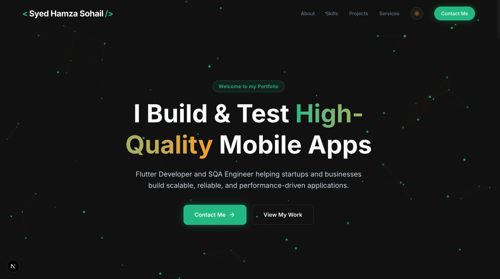

# SYED-HAMZA-SOHAIL-PORTFOLIO

A premium, 3D interactive portfolio showcasing the work of **Syed Hamza Sohail** — a Flutter Developer and Software Quality Assurance (SQA) Engineer.

 

## 🚀 Overview

This portfolio is built to demonstrate a unique blend of **mobile development expertise** and **rigorous quality engineering**. It features an immersive 3D user interface, dynamic project case studies, and a seamless responsive design.

### Key Features
- **3D Interactive Elements:** Smooth particle systems and 3D tilt effects using Framer Motion.
- **Dynamic Case Studies:** Deep dives into production apps like Rattil, Al Athar, and TireMate.
- **System Theme Sync:** Automatically respects user OS/browser theme (Light/Dark mode).
- **Premium UX:** Full-width responsive navbar, custom mobile menu, and optimized performance.
- **Contact Integration:** Functional inquiry system powered by EmailJS.

## 🛠️ Tech Stack

- **Framework:** Next.js 15 (App Router)
- **Language:** TypeScript
- **Styling:** Vanilla CSS / TailwindCSS
- **Animations:** Framer Motion
- **Icons:** Lucide React
- **Email Service:** EmailJS

## 📦 Project Structure

```text
src/
├── app/            # Next.js App Router (Pages & API)
├── components/     # Reusable UI & 3D Components
├── data/           # Centralized Project & Content Data
└── styles/         # Global Theme & CSS Variables
```

## 🏗️ Getting Started

1. **Clone the repository:**
   ```bash
   git clone https://github.com/hamzashah007/Portfolio-Website.git
   ```

2. **Install dependencies:**
   ```bash
   npm install
   ```

3. **Run the development server:**
   ```bash
   npm run dev
   ```
---

Built with 💚 by [Syed Hamza Sohail](https://github.com/hamzashah007)
